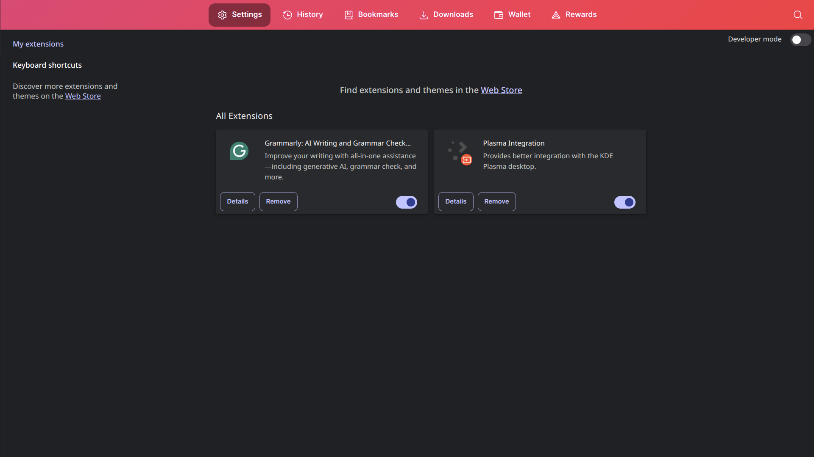

# ElateLabs-task7
This repository displays different extension installed on a browser and explains about malicious extensions

1. Extension installed and its permission and reviws

To find extension page you can simply use the following format on the browsers address bar

```
    <browser>://extensions/
```

Example :
