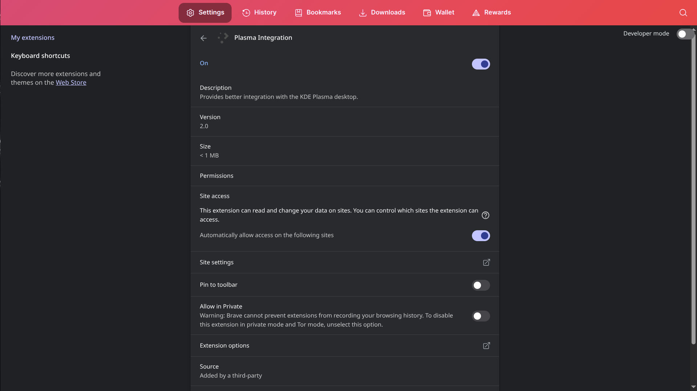

# ElateLabs-task7
This repository displays different extension installed on a browser and explains about malicious extensions

1. Extension installed and its permission and reviws

To find extension page you can simply use the following format on the browsers address bar

```
    <browser>://extensions/
```

>Example :


>To find if a extension is safe or not always check the reviews before installing it


>For any installed extensions it is always necessary to check the permission given to the extension


```
Why to check extensions you install and use : 
```
Internet is not always safe people want your data and use it for their own profit or even fun. Using malicious extension they can do any of the following :-

1. Steal your passwords, credit card info, and personal data.
2. Log everything you type, including sensitive information.
3. Modify websites to display fake ads or phishing links.
4. Track your browsing activity and online behavior.
5. Redirect you to malicious or fake websites.
6. Use your computer to secretly mine cryptocurrency.
7. Download and install additional malware in the background.
8. Pretend to be trusted extensions to trick you.
9. Abuse permissions to read, change, or control web content.
10. Monitor and extract data from your clipboard or downloads.